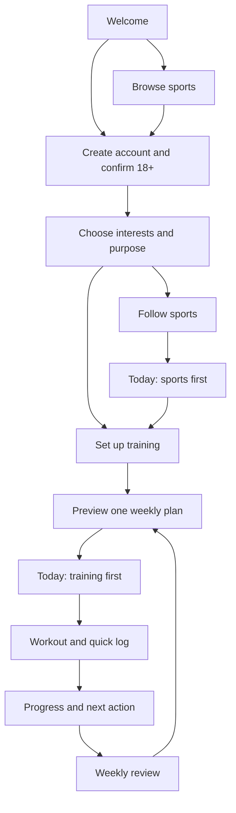

# Fight Hub — Screens and First-Week Member Journey

Updated: 2026-09-26

Status: proposed product design for discussion and prototyping, not implemented functionality. Builds on [the product plan](../PLANNING.md). Screen IDs are planning references, not final URL routes.

## 1. Experience principles

Fight Hub connects interest in combat sports with a manageable fitness routine. Fitness, strength and conditioning belong in one schedule, balanced around the member's main goal. Sport preferences personalise discovery; they do not establish readiness for sport-specific training.

- Give members a useful next action each time they return.
- Let fans follow sports without completing training setup.
- Make the first completed workout and saved result available free.
- Keep logging short and personal progress understandable.
- Treat recovery and returning after a break as normal parts of consistency.
- Keep browsing available when a member does not want to train.

## 2. Mobile navigation

| Destination | Main purpose | Primary action |
| --- | --- | --- |
| Today | Personal home, next session, progress summary and followed sports | Start or resume today's session |
| Train | Weekly schedule and programme library | View or organise the week |
| Progress | Workout history, consistency and performance | Review recent progress |
| Explore | Sports, fighters, news, guides and events | Follow interests or open content |

Profile, preferences and membership are accessible from the account button. Events have a prominent filter within Explore rather than a fifth main destination. For fans, Today leads with followed sports and upcoming events; training remains available through Train.

## 3. Screen inventory

| ID / screen | Information shown | Main action and important states |
| --- | --- | --- |
| S01 Welcome | Product promise, example experience, free entry and sign-in | Get started or browse; no price invented before commercial decisions |
| S02 Account | Minimal account fields, 18+ confirmation, terms/privacy links | Create account or sign in; show validation, recovery and expired-session states; under-18 declaration cannot proceed to membership |
| S03 Interests and purpose | Sports, follow/train/both choices, optional fighter interests | Save interests; allow edits later and skip optional choices |
| S04 Goals and experience | Main goal, secondary goals, general training experience | Continue; main goal sets programme emphasis, not a second subscription |
| S05 Training setting | Home/gym/both, equipment, days, session length and existing training commitments | Continue; distinguish no equipment from missing information |
| S06 Plan preview | Weekly layout, programme scope, expected session lengths and why it matches selections | Accept starter plan or edit setup; if no supported match exists, explain and offer supported options |
| S07 Today | Next session or recovery day, weekly target, recent result and relevant sports content | Start/resume, view plan or browse; fan, first-use, rest-day and missed-session variants |
| S08 Weekly plan | Scheduled sessions, recovery days, completion and missed-session states | View session or move it; no automatic doubling of missed work |
| S09 Programme library/detail | Programme goal, level, equipment, schedule, content version and free/paid status | Preview or select; switching affects future sessions, never deletes history |
| S10 Session preview | Exercises, equipment, duration, instructions and supported alternatives | Start workout; show unavailable-media and unsupported-equipment states before starting |
| S11 Active workout | Current exercise, instructions, sets/reps, rest timer and recorded work | Log, pause, skip or finish; elapsed time alone never marks exercises complete |
| S12 Session summary | Completed work, optional difficulty rating and optional note | Save session and show next step; partial sessions can be saved; duplicate taps create one entry |
| S13 Progress | History, sessions completed, weekly consistency and comparable exercise results | Open a past session; first-entry state explains what will appear as history grows |
| S14 Weekly review | Planned/completed sessions, recovery check-ins, personal milestones and next-week preview | Keep schedule or edit availability; no automatic load increase based only on attendance |
| S15 Explore | Sport filters, followed interests, news, guides, fighter profiles and events | Follow, save or open; offer general coverage when personalised results are empty |
| S16 Content/fighter/event detail | Source and date where applicable, fighter history or event time/status | Follow or return; show event times in local time with timezone context; distinguish confirmed and uncertain information |
| S17 Membership | Actual tier comparison, price/currency, billing period and renewal/cancellation terms | Upgrade or remain free; show pending, successful, failed and cancelled checkout states |
| S18 Account and preferences | Interests, units, timezone, reminders, membership, data controls and help | Edit settings, manage/cancel membership or request account deletion; explain deletion consequences |

These are logical screens. Several may share one view or become a short multi-step flow during prototyping. Authentication and payment providers remain undecided.

## 4. Setup boundaries

Required for training: main goal, experience, setting/equipment and schedule. Sports interests support personalisation. Do not require weight, body photos, calorie targets or sensitive medical details to start the proposed fitness experience.

Show programme scope before acceptance. A competitor can use general fitness features, but this release does not provide fight preparation or replace their existing training arrangements. Existing classes and workouts should inform availability without generating unreviewed combined workloads.

Self-declaring 18+ is a proposed interface step, not a claim of verified age. Determine the appropriate account and age approach before launch. English-first remains a working assumption awaiting confirmation.

## 5. First-week example: member who wants to train

Illustrative product journey only, not an exercise prescription. Assume a member chooses boxing as an interest, fitness as their main goal, strength as a secondary goal and three training days. Actual exercises and workloads depend on the eventual reviewed programme catalogue.

| Moment | Member experience | Product response / reason to return |
| --- | --- | --- |
| Arrival | Browses Fight Hub and sees what a free membership offers | Makes the fitness and sports benefits clear before registration |
| Setup | Chooses interests, goals, equipment and available days | Previews one coherent starter week; explains the fit in plain language |
| Day 1: first session | Opens instructions, completes or partially completes a session and saves a short log | Confirms the save, establishes a starting point and shows the next scheduled action |
| Day 2: recovery and sport | Sees a recovery day and news or an event from a followed sport | Optional recovery check-in; no pressure to add a workout |
| Day 3: next session | Finds the next planned session and records completed work | Shows relevant previous entries where comparisons are meaningful |
| Day 4: schedule change | Needs to move the next session | Offers a supported move or skip; avoids cramming missed work into remaining days |
| Day 5: planned session | Completes the rescheduled session | Updates progress against the revised schedule without inventing performance gains |
| Day 6: browse or rest | Checks an event or takes the day off | Optional content; no loss of earned milestones for not opening the app |
| Day 7: weekly review | Sees the week, reflects and previews the next one | Retains history, offers availability changes and makes the next week clear |

The app should be useful every day without requiring daily use or daily exercise. Users choose their own start date; the review follows their programme week and local time.

## 6. Other audience paths

### Fan first

Browse → create account → follow sports/fighters → sports-first Today → event/news detail → return to followed content. Training setup is optional and can be started later. Do not show an empty workout dashboard to a fan.

### Existing recreational trainee

Choose interests → record experience, equipment and existing commitments → choose a supported general-fitness plan → log relevant sessions → review progress. Do not presume all existing activity is tracked automatically.

### Competitor

Follow sport coverage and use supported fitness/logging features. Clearly identify the general-fitness scope; do not imply competition readiness or sport-specific coaching based on choosing a competitor profile.

### Returning after a break

Show saved history and offer a revised schedule or programme restart. Preserve achievements and avoid catching up by stacking workouts. Any progression/restart rules must be defined with the programme content.

## 7. Free-to-paid journey

1. Let members complete the free starter experience and see saved progress.
2. Present an upgrade when they deliberately open a paid programme or request a paid planning feature. The weekly review may include a dismissible relevant offer.
3. Show exactly what changes, alongside the actual price and billing terms.
4. Confirm payment through the payment system before activating paid access; handle pending results honestly.
5. On cancellation, explain the access end date. Retain basic history and free functionality after downgrade. Define treatment of an in-progress paid programme before implementation.

Basic session movement, supported exercise alternatives within a chosen free programme and error corrections should be free usability features. Proposed paid value is broader programme access, richer planning options and deeper insights. This refines the earlier tier proposal and still requires validation; it is not a final pricing commitment.

Never interrupt an active workout or prevent saving its log with an upgrade screen. Payment details should be handled by the selected payment provider rather than stored as raw card data in Fight Hub.

## 8. Reminders, installation and interrupted sessions

- Offer reminder preferences after a member accepts a schedule; keep them optional and configurable in local time.
- Offer home-screen installation after the member has experienced value. Validate browser-specific installation and notification behaviour before finalising copy.
- A workout interruption should resume from saved progress where supported. Clearly distinguish local/pending data from a confirmed server save.
- Define minimal local draft recovery during technical design. Full offline browsing, offline programme downloads and background health tracking are not first-release promises.
- If a content feed fails, keep training and saved progress usable and show when content was last refreshed.
- Make text, timers and controls accessible, with usable labels, contrast and tap areas. Do not convey completion solely through colour or animation.

## 9. Data needed to support the journey

| Record | Purpose |
| --- | --- |
| Account and preferences | Identity, age eligibility declaration, timezone, units, interests and notification preferences |
| Programme and exercise versions | Published instructions, scope, sources/review status, equipment and supported progression rules |
| Member plan | Accepted programme version, schedule and future changes |
| Workout session and entries | Draft/completed/partial state, actual work, optional difficulty, timestamps and save state |
| Follows and content references | Personalised sports feed without assuming ownership of external content |
| Membership entitlement | Current access and billing-provider reference/status |

Preserve historical programme versions so old logs remain understandable. Avoid storing sensitive free-text workout notes in product analytics. Define retention, export/deletion handling and access controls during technical planning.

## 10. Validation before implementation

Prototype these tasks with representative fans and trainees:

1. Find a sport and follow it without entering training details.
2. Set up a home or gym plan and explain why it suits the selected goal.
3. Start, pause, resume and save a partial workout without losing entered work.
4. Move a session and understand what happens to the rest of the week.
5. Find a previous result and understand the comparison shown.
6. See the paid benefits, decline an upgrade and continue free.
7. Return after missing a week without feeling required to catch up.

Launch acceptance should additionally verify duplicate-save protection, timezone boundaries, unsupported plan matches, feed failure, account recovery, payment failure, cancellation and mobile installation behaviour on selected supported browsers. These are future acceptance checks; no application has been built or tested yet.

## 11. Product measurement proposals

| Question | Candidate measure |
| --- | --- |
| Can members get started? | Training setup completion among people who start it; measure fan setup separately |
| Do they experience training value? | First saved workout within seven days of accepting a plan |
| Do they return? | Week-two return and meaningful activity, segmented by fan/training intent |
| Is the schedule useful? | Completed sessions against planned sessions, retaining schedule-change context |
| Does paid membership add value? | Upgrade rate among members shown an offer and paid retention |

Targets remain unset until prototype and early-use evidence is available. Track only the minimum events needed; account registration alone is not a completed training activation.

## 12. Next deliverable and unresolved dependencies

Next: low-fidelity screen layouts for Welcome, setup, Today, weekly plan, workout and weekly review, using clearly labelled sample content.

Before choosing a stack or building production integrations, inspect the existing Fight Hub site/code, determine the programme sourcing/review approach, confirm the initial catalogue, settle the membership boundaries and assess hosting/payment costs. The existing website is still uninspected; no API compatibility is assumed.
